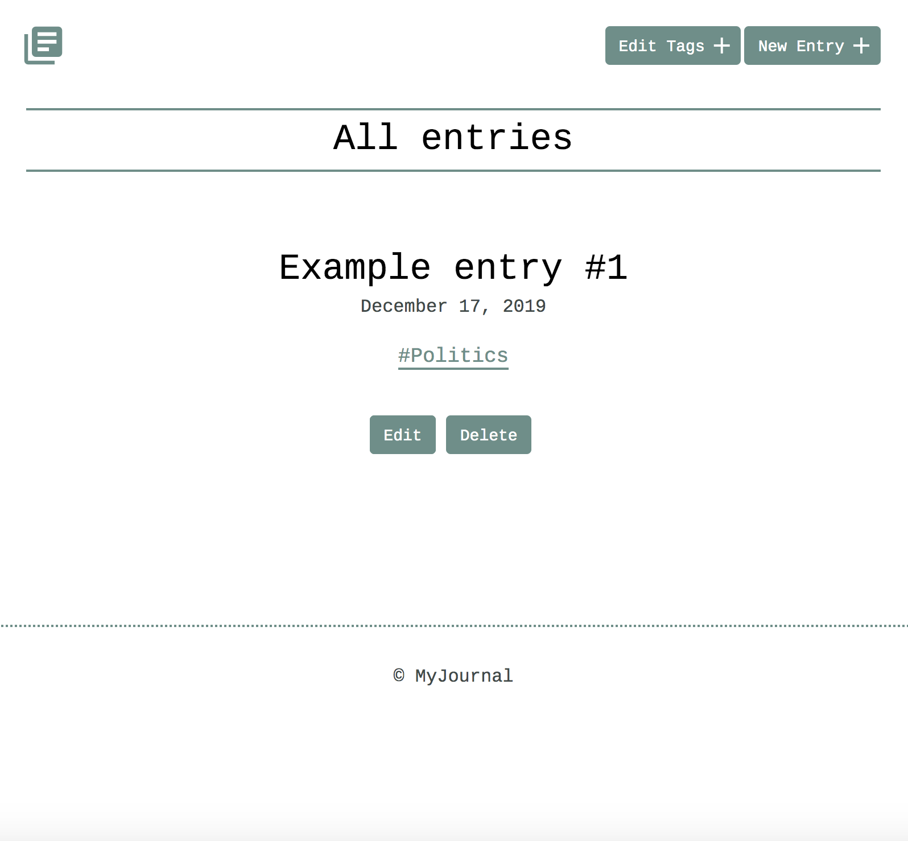
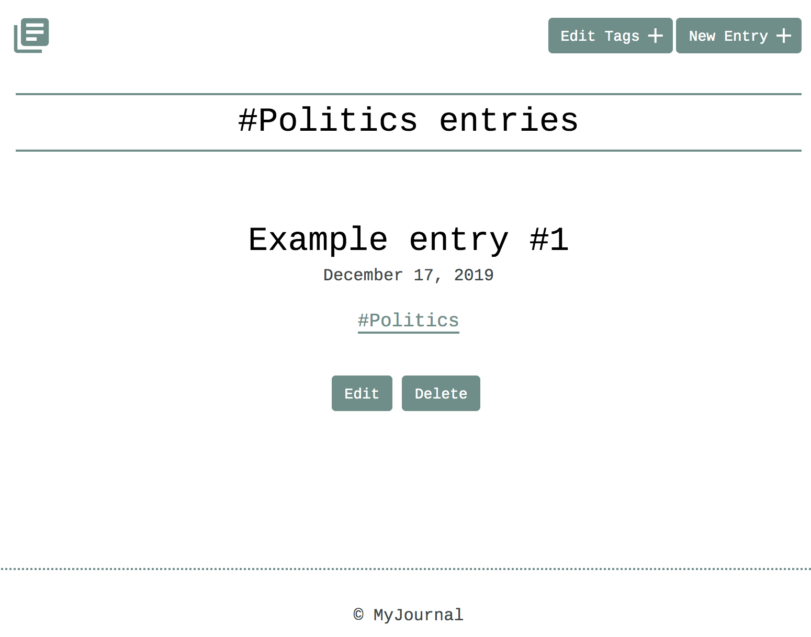
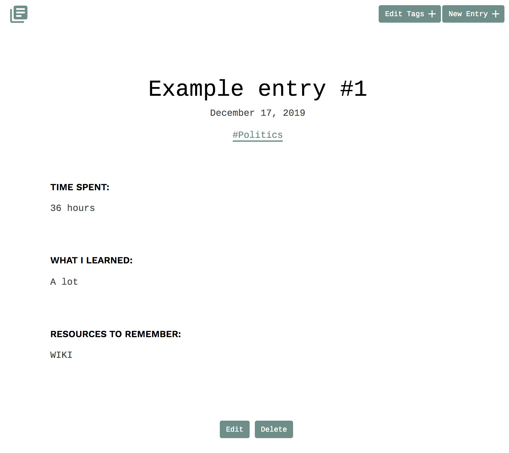
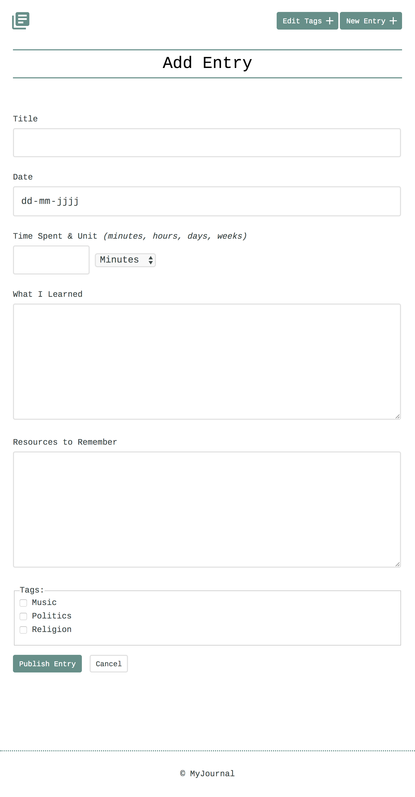
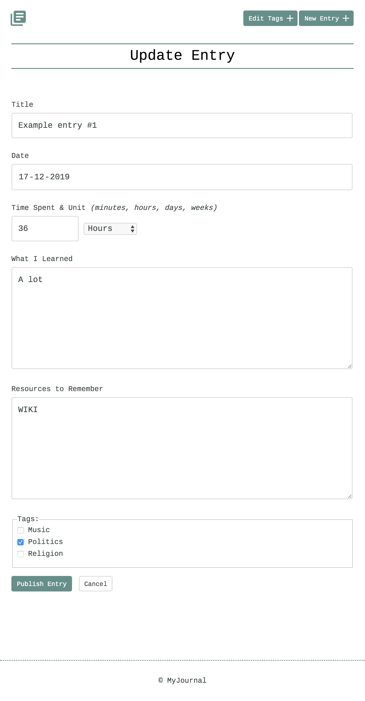
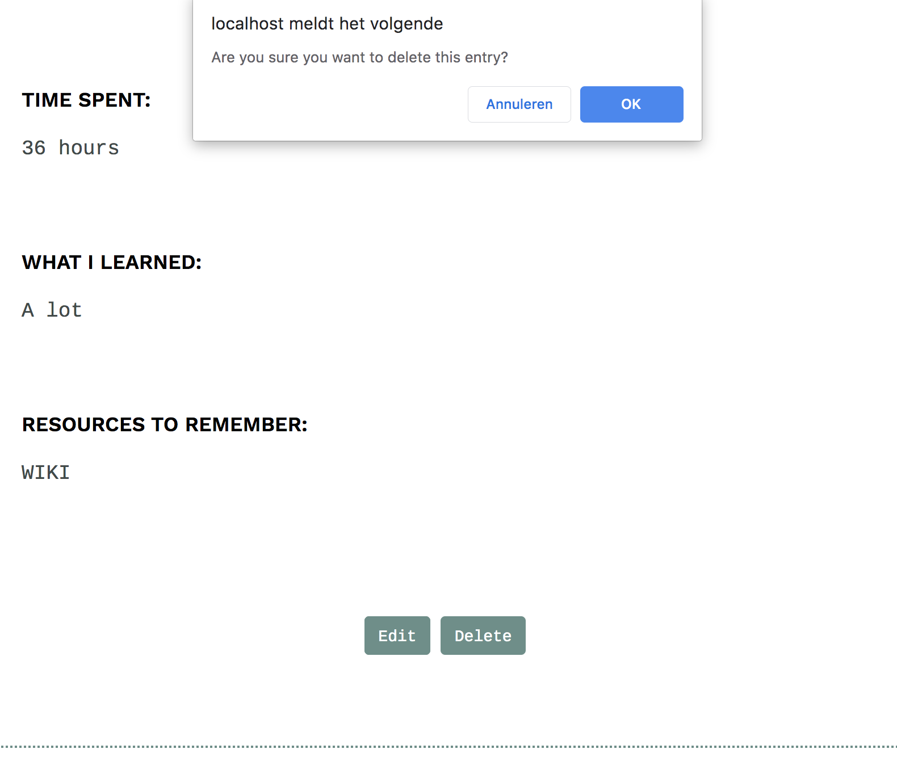
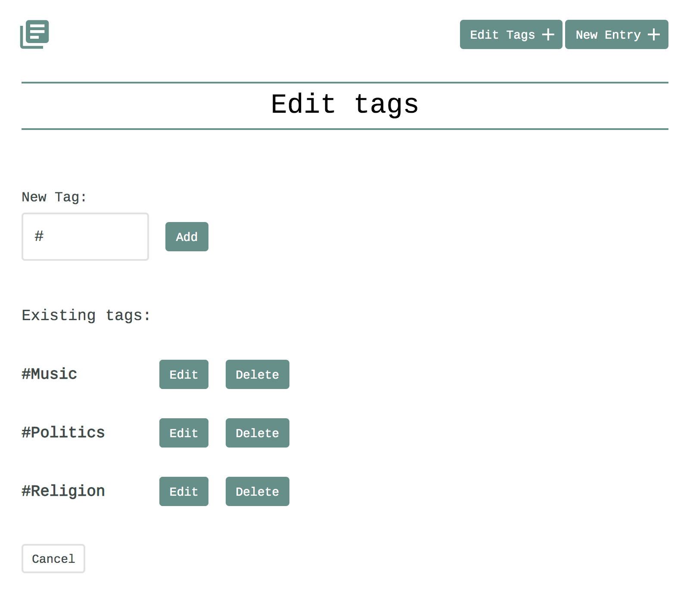

# A learning journal app based on PHP, PDO, SQL and SQLite
### PHP Team Treehouse TechDegree project #3

- [What the app does](#what-the-app-does)
- [Tech used](#tech-used)
- [Folder & file structure](#folder--file-structure)

## What the app does
#### In this blog app you will experience the following functionalities:
1. Viewing all blog posts, incl. their tags
<kbd>

</kbd>
2. Filtering the blog posts by tag

3. Viewing blog details, reading its comments and adding new comments

4. Adding blogs, incl. their tags

5. Editing blog details, incl. their tags

6. Deleting blog posts

7. Managing tags: retrieving, adding, updating & deleting tags. And when done, of course, you can start using the tags for your posts

## Tech used
#### In this app the following main languages, principles and other technologies are applied:
PHP | Exception handling | Filtering input & escaping output | PDO | SQL CRUD operations | SQLite | HTML | CSS

## Folder & file structure
#### The most important folders & files within this project:

      .
      ├── css                         # contains the css files               
      ├── inc                         # contains the SQLite database, connection, functions, header & footer files
      ├── add_or_edit.php             # screen for both adding & editing journal entries
      ├── detail.php                  # screen which displays the entry details
      ├── index.php                   # main learning journal screen with all entries
      └── tags.php                    # screen to manage tags: add, edit & delete
